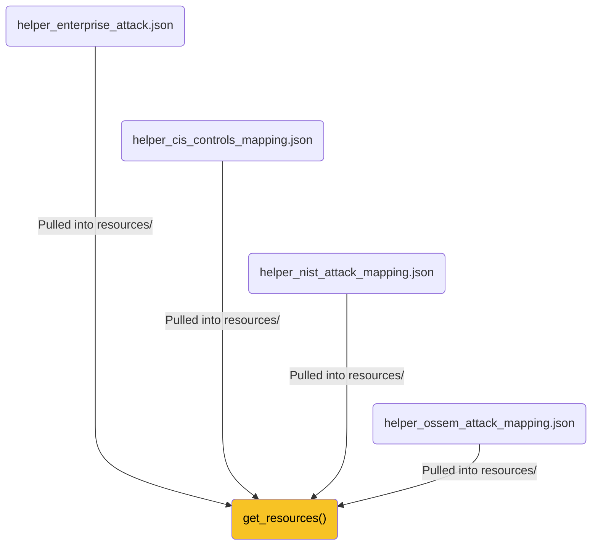
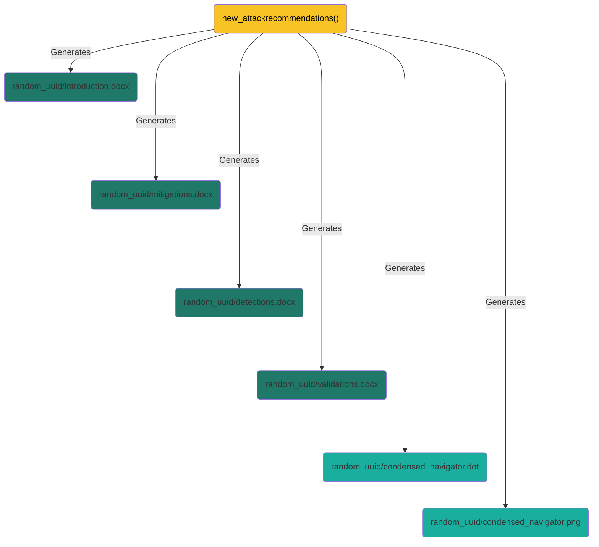
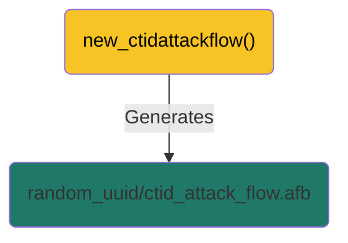
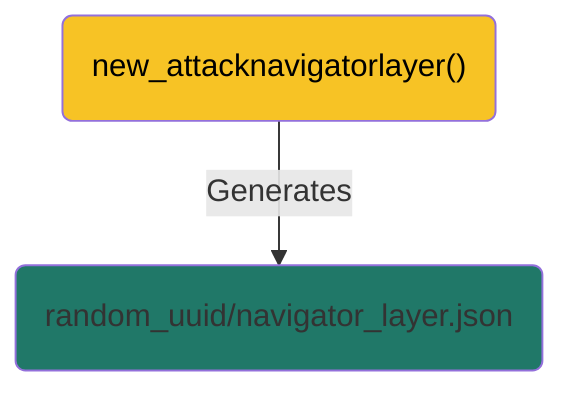
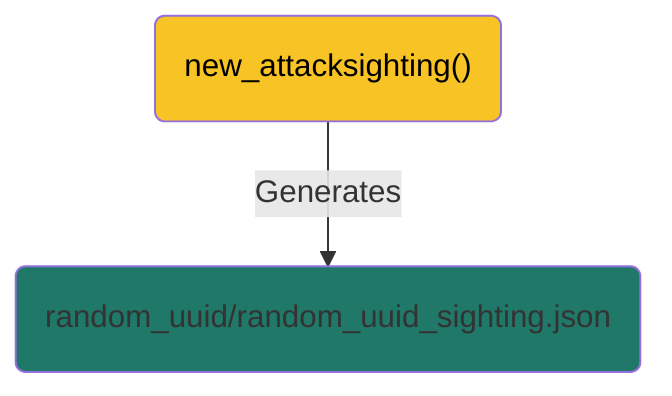

## Prerequisites
There's still a manual component involved for the results to be generated, namely the identification of the observed (Sub-)Techniques. Another MITRE project, [TRAM](https://github.com/center-for-threat-informed-defense/tram/), or [CISA's decider](https://github.com/cisagov/decider) has the potential aiding with this. TRAM may eventually automate the process but is still at an academic/research level whereas decider is a fully functional environment.

So we still require an analyst, preferably not the owner/originator/writer of the report, to skim manually through the report for identifying the possible ATT&CK® (Sub-)Techniques.

### Input
The following options are available as input
- A manually compiled list of ATT&CK® (Sub-)Techniques, for example T1486;T1490;T1027;T1047;T1036;T1059;T1562;T1112;T1204;T1055

### Output
- Microsoft Word

## Installation
Pull the scripts and templates files.
Prepare and activate a virtual environment, pull the required packages (python-docx).

    python -m venv env
    ./env/Scripts/activate
    pip install -r scripts/requirements.txt

## Running

    python -i scripts/AttackIrReporting.py

## Pulling the resources

The function allows to gather the files it will be used to perform the mapping with CIS Controls, NIST 800-53 rev 5, OSSEM-DM and Atomic Red Team™.

    >>> get_resources()

The function accepts arguments that allows for forcing new downloads or pulling a specific version of MITRE ATT&CK®.

    >>> get_resources(attack_force=False, attack_version=None, cis_force=False, nist_force=False, ossem_force=False, atomicred_force=False)
    >>> get_resources(atomicred_force=True)
    >>> get_resources(attack_version="12.0")
    

### Downloads/Generating
The following files are to be expected to be downloaded when the function is run:
- resources/helper_enterprise_attack.json (downloaded from Mitre Github)
- resources/helper_cis_controls_mapping.json (downloaded from nightly-nessie Github)
- resources/helper_nist_attack_mapping.json (downloaded from CTID Github)
- resources/helper_ossem_attack_mapping.json (downloaded from OSSEM-DM Github)

### Issues/Notes

 - The provided helper_cis_controls_mapping.json is an unofficial STIX formatted [CIS Controls mapping against ATT&CK v12.1](https://www.cisecurity.org/controls/v8).
 - The downloaded helper_nist_attack_mapping.json is at the time of release [mapping NIST 800-53 Rev 4 and Rev 5 against ATT&CK v10.1](https://github.com/center-for-threat-informed-defense/attack-control-framework-mappings)

## Providing ATT&CK® Tecniques as Manual Input

The function requests a single or a list of identified (Sub-)Techniques to be given in the format used by MITRE to define these, eg [T1059.001](https://attack.mitre.org/techniques/T1059/001/). If not passed as argument, it will request a semi-column separated list of ATT&CK® (Sub-)Techniques.

    >>> set_attack_empty()

The function accepts a string of semi-column separated list of ATT&CK® (Sub-)Techniques as an argument.

    >>> set_attack_empty("T1486;T1490;T1027;T1047;T1036;T1059;T1562;T1112;T1204;T1055;T1053.005")

During runtime, the function will request to validate the pairs to witheld if an ATT&CK® (Sub-)Technique is associated with multiple Tactics, eg [T1053.005](https://attack.mitre.org/techniques/T1053/005/) can be tied to the following Tactics: Execution, Persistence, and Privilege Escalation. The validation is skipped if there is only one pair identified.

    Multiple tactics were found for T1053.005: Execution, Persistence, Privilege Escalation
    ⌨ Do you want to add T1053.005: Scheduled Task/Execution pair ([Y]/N)

## Generating the documents for recommendations

This function allows for generating WORD documents introduction.docx, mitigations.docx, detections.docx, and validations.docx. It will request a prefix to the documents and whether or not the mapping with CIS Controls and/or NIST 800-53 rev 5 should be generated.
Snippets of these documents are shown below:

    >>> new_attackrecommendations()

The function accepts arguments, new_attackrecommendations(prefix=None,ciscontrols=True,nistcontrols=False), that allows for passing the prefix and the requirements for the CIS Controls and/or NIST 800-53 rev 5. 

    >>> new_attackrecommendations("IR11337")
    >>> new_attackrecommendations("Some unnamed case",ciscontrols=False,nistcontrols=True)

### Downloads/Generating
The following files are to be expected to be generated when the function is run, prepended with the prefix if provided:
- random_uuid/introduction.docx (generated)
- random_uuid/mitigations.docx (generated)
- random_uuid/detections.docx (generated)
- random_uuid/validations.docx (generated)
- random_uuid/condensed_navigator.dot (generated)
- random_uuid/condensed_navigator.png (generated)

### Issues/Notes

- The generated recommendations may be overwhelming to a customer and may require reduction to be digestible for the intended audience. This is also tied to the maturity and having that conversation with the customer feels like the only right way to do so.

## Generating a CTID ATT&CK® Flow afb file

The function generates a CTID ATT&CK® Flow afb file allowing to quickly lay out the flow with the [MITRE ATT&CK® Flow Builder](https://center-for-threat-informed-defense.github.io/attack-flow/ui/). It uses the already provided information regarding the ATT&CK® (Sub-)Technique, the associated Tactics and the prefix.

    >>> new_ctidattackflow()

The function accepts a string of semi-column separated list of impacted Assets to be generated. It does not request for the ATT&CK® (Sub-)Techniques. The latter are used from set_attack_empty().

    >>> new_ctidattackflow("DC001_BXL;Dormant File Server;CorporateIISServer")

### Output and further work

The generated afb file can be opened with the Flow Builder and would look like:

### Downloads/Generation
The following file is to be expected to be generated when the function is run, prepended with the prefix was previously provided:
- random_uuid/ctid_attack_flow.afb (generated)

### Issues/Notes

- The ctid_attack_flow.afb is a starting point that generates the Actions per identified (Sub-)Technique / Tactic pair. It may also include the optional Assets. According to the available information and detail required, many more work needs to be performed on the flow itself within the Builder.
- Some fields of ctid_attack_flow.afb are prefilled for Check Point IRT, this can be changed in the [script code](../scripts/AttackIrReporting.py#L1115).
- The colour scheme of ctid_attack_flow.afb cannot be changed in the GUI of the Builder but can be addressed in the [script code](../scripts/AttackIrReporting.py#L866).

> var_obj_flow_property_background_colour = "#ffffff"

...

> var_obj_flow_objects_property_box_colour = "#fefefe"

## Generating an ATT&CK® Navigator Layer

The function generates an ATT&CK® Navigator Layer. It uses the already provided information regarding the ATT&CK® (Sub-)Technique, the associated Tactics and the prefix.

    >>> new_attacknavigatorlayer()

The script does not have arguments to pass.

### Downloads/Generation
The following file is to be expected to be generated when the function is run, prepended with the prefix was previously provided:
- random_uuid/navigator_layer.json (generated)

### Issues/Notes

- None.

## Generating a CTID ATT&CK® Sighting

The function allows for generating a sighting based on the specifications described in the [sightings model](https://github.com/center-for-threat-informed-defense/sightings_ecosystem). 

    >>> new_attacksighting()

It will therefore request additional information, such as
- RFC 3339 timestamps in UTC time
- the victim sector NAICS code (the function accomodates for presenting a list of the valid codes)
- the victim ISO 3166-1 alpha-2 country code
- the detection source [host_based, network_based, cloud_based]
- the platform [windows, macos, nix, other]
- the privilege level [system, admin, user, none]
- the software name if applicable, preferably according to the [MITRE ATT&CK® Software list](https://attack.mitre.org/software/)

### Downloads/Generating
The following files are to be expected to be generated when the script is run:
- random_uuid/random_uuid_sighting.json (generated)

### Issues/Notes

- None.
